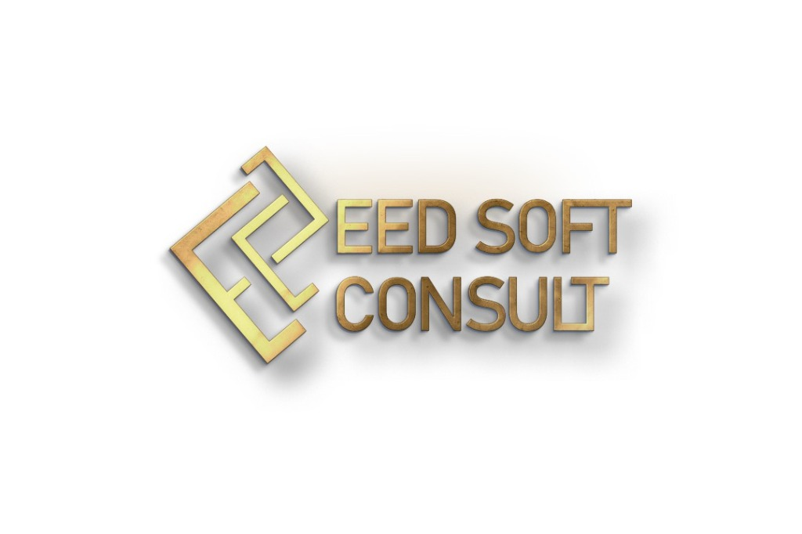

<div align="center">



# 🛠️ Building a Coding Agent From Scratch

### Build the harness behind a modern coding agent — permissions, checkpoints, sandboxing, context engineering, sub-agents and evaluation.

**A course by [EED Soft Consult](https://eedsoftconsult.com)**


</div>

---

## About the course

Modern coding agents are not useful because of the model alone. Their **harness** determines what the model can see, which tools it can call, how risky actions are controlled, how context is managed, whether work can resume after failure, how sub-agents are coordinated, and how behaviour is evaluated.

This eight-week course turns those ideas into runnable Python implementations.

The material draws on public engineering patterns from modern coding assistants, open-source agent systems, published research, and hands-on implementation. It includes references to projects such as OpenCode, Aider, NVIDIA OO Agents (NOOA), LangChain's agent-harness experiments, and DecodingAI's public coding-agent course.

The goal is not to treat Claude Code, Codex, or any other coding assistant as a black box. It is to understand and implement the general engineering patterns that make agentic development systems reliable and useful.

## What you build

| Week | Topic | Core outcome |
|---|---|---|
| 1 | Bare Agent Loop | ReAct-style prompt → tool call → answer flow with permission gating |
| 2 | Resumability & Checkpoints | Crash-safe execution that can recover after interruption |
| 3 | Replay & Model Swap | Replay runs from checkpoints and compare model behaviour |
| 4 | Containment & Sandboxing | Graduated trust modes and Docker-isolated tool execution |
| 5 | Context as a Budget | Token tracking, memory, compaction and skills injection |
| 6 | Harness Design | Agent-as-object patterns inspired by NVIDIA NOOA |
| 7 | Parallel Sub-agents | Fan-out workers with budgets and structured report contracts |
| 8 | Evaluation & Capstone | Benchmarks, regression probes, LLM-as-judge and issue → PR workflow |

## Core concepts

### Agent loop

A minimal tool-calling loop is straightforward:

```python
messages = [system_prompt] + history + [user_message]

for iteration in range(max_iterations):
    response = await provider.chat(messages, tools=TOOL_SCHEMAS)

    if response.tool_calls:
        for tool_call in response.tool_calls:
            if ask_permission(tool_call):
                result = execute_tool(tool_call)
            messages.append(tool_result)
        continue

    return response.content
```

The course focuses on everything around that loop:

- permission gates;
- durable checkpoints;
- replay;
- sandboxing;
- context budgeting;
- memory and skills;
- sub-agent coordination;
- evaluation infrastructure.

## Try Week 1

```bash
git clone https://github.com/silsgah/coding-agent-course
cd coding-agent-course
uv venv && source .venv/bin/activate
uv pip install -r requirements.txt
cp .env.example .env
uv run week-01-bare-agent-loop/code/agent.py
```

Then try:

```text
What files are in the current directory?
```

The agent will move through a full prompt → tool call → permission gate → answer cycle.

## Course structure

```text
coding-agent-course/
├── shared/
│   ├── config.py
│   ├── models.py
│   └── utils.py
├── week-01-bare-agent-loop/
├── week-02-resumability-checkpoints/
├── week-03-replay-model-swap/
├── week-04-containment-sandboxing/
├── week-05-context-budget/
├── week-06-harness-design/
├── week-07-parallel-subagents/
└── week-08-evaluation-real-world/
```

Each week contains:

- a narrative `README.md`;
- runnable Python code;
- hands-on exercises;
- reference material.

## What the course demonstrates

### Permission-aware tool use

The agent does not treat every tool call as equally safe. The course introduces graduated trust modes and explicit approval for higher-risk actions.

### Durable execution

Checkpointing allows a task to survive interruption and continue without repeating already-completed work.

### Replay as a debugging tool

Runs can be replayed from an earlier checkpoint with a different model, which makes agent behaviour easier to inspect and compare.

### Containment

Docker-based workspace isolation demonstrates how tool execution can be separated from the host environment.

### Context engineering

The course treats the context window as a finite resource and explores:

- token budgets;
- compaction;
- persistent instructions;
- memory files;
- skills injection.

### Parallel sub-agents

A coordinator can fan work out to child agents, each with its own budget and a structured report contract, before merging the results.

### Evaluation

The final week moves beyond unit tests into agent-specific evaluation:

- repeatable task benchmarks;
- regression probes;
- scoring;
- LLM-as-judge experiments;
- end-to-end issue-to-PR workflows.

## Evidence-driven design

One of the recurring ideas in the course is that the harness can materially change agent behaviour even when the underlying model is unchanged.

We examine public evidence including:

- [LangChain's agent harness analysis](https://www.langchain.com/blog/the-anatomy-of-an-agent-harness)
- [NVIDIA OO Agents (NOOA)](https://github.com/NVIDIA-NeMo/labs-OO-Agents)
- [NOOA paper](https://arxiv.org/abs/2607.20709)
- [DecodingAI — Building a Coding Agent From Scratch](https://github.com/decodingai-magazine/building-a-coding-agent-from-scratch-course)

Students also measure their own implementations through replay, context-budget and harness-design exercises.

## Who this is for

| Audience | Why it is useful |
|---|---|
| ML / AI Engineers | Build a complete agent harness rather than another notebook demo |
| Software Engineers | Understand the architecture behind coding assistants |
| AI / Platform Engineers | Practice durability, permissions, sandboxing and evaluation |
| Technical Founders | Develop a practical mental model for agent-system architecture |

## Prerequisites

- intermediate Python;
- basic familiarity with LLMs;
- a modern laptop or workstation;
- Docker for the sandboxing week.

The default examples can use Gemini or OpenRouter-compatible providers, so the course can be explored without dedicated GPU hardware.

## How each lesson works

```text
1. SEE IT WORK
   Run the finished feature first.

2. EXTRACT THE PRINCIPLE
   Understand why the design exists and what breaks without it.

3. BUILD IT
   Implement the pattern yourself.

4. EXERCISE IT
   Stress the implementation and measure behaviour.
```

## Why build from scratch?

Frameworks are useful, but using them effectively is easier when you understand the underlying mechanics. Building one agent harness from first principles gives you a reusable mental model for evaluating or extending higher-level tools later.

## Reference material

This course credits and builds on public work from:

- DecodingAI's coding-agent course;
- NVIDIA OO Agents (NOOA);
- LangChain's public harness experiments;
- OpenCode;
- Aider;
- other public agent-engineering literature referenced inside the weekly lessons.

## Contributing

Found a bug or improvement? Open an issue or pull request.

## License

Released under [Apache-2.0](LICENSE).

---

<div align="center">


**Built by [EED Soft Consult](https://eedsoftconsult.com)**

*AI Training · Software Engineering · Consulting*

</div>
